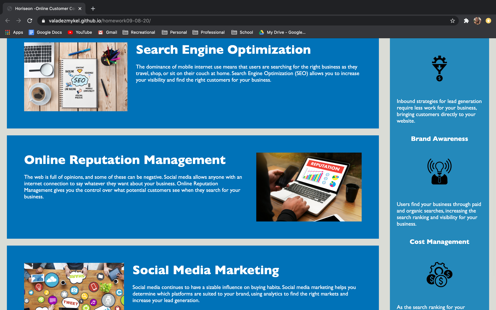

# homework09-08-20

### Links

link to the [repository](https://github.com/valadezMykel/homework09-08-20).

link to luanched [site](https://valadezmykel.github.io/homework09-08-20/).

------

### About This Repo

This repo contains the html and css files for a webpage about the company Horiseon.   

------

### Latest Project Goals

The purpose of this project was to refactor the html of an existing webpage to increase symantic value.  Increasing the symantic value of the webpage will make it more accesible to users, especially userers with disabilities.  To do this html tags must be replaced for ones that provide semantic meaning such as including a main, section, or artilce tag when applicable. 

------

### Project outcome

Successfully created semantic meaning by applying approprate html tags.  Also cleaned up the css page by appyling the DRY rule.

------

### Futrue Work

- Create html pages for the links on the index html
- Create javascript to animate site pages

-------

### Instalation

##### API

no API need

##### Install from Github

clone repository using SSH key of HTTPs

-------

### Contributors

Mykel Valadez <valadezmykel@gmail.com>

